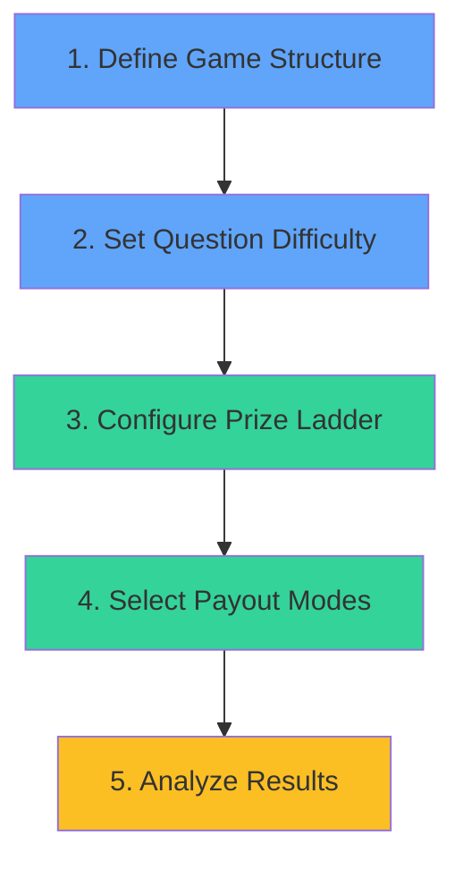

# F2P Interactive Odds Demo - User Guide

## Purpose of This Tool

The **F2P Interactive Odds Demo** is a sophisticated prizing simulator designed for Free-to-Play (F2P) gaming operators and product managers. It helps you:

- **Project winner distributions** for prediction-based games
- **Calculate expected prize costs** across different payout structures
- **Optimize prize ladders** to balance player engagement and operational costs
- **Model different game formats** (Pick 6, NFL Pick'em, Quiz games, etc.)
- **Compare payout modes** (Split vs. Guaranteed prizes)

The tool uses **Poisson-binomial distribution** to accurately model score distributions when questions have different difficulty levels, providing precise expected value calculations for prize budgeting.

---

## Understanding Operations: Logic & Priority

### Core Workflow Priority

The simulator follows this operational hierarchy:



### 1️⃣ **Game Structure** (Highest Priority)

**What it controls:** Number of questions and participants

**Operations:**
- **Participants** - Set the player count (default: 1,000)
- **Number of Questions** - Define game length (1-50 questions)
- **Game Template** - Quick-load predefined game structures

**Priority:** This must be set first, as it determines the size of all subsequent calculations.

**CSV Impact:** When loading a CSV, the number of questions is automatically set based on the file content.

---

### 2️⃣ **Question Configuration** (High Priority)

**What it controls:** Individual question difficulty and probability

**Operations:**
- **Add Question** - Manually add individual questions
- **Load CSV** - Bulk import questions from a CSV file
- **Load Example** - Load a pre-configured 8-question example
- **Clone Top Row to All** - Copy the first question's text and odds to all rows
- **Apply Uniform Odds** - Set the same odds across all questions

**Odds Explained:**
- Odds are in **decimal format** (e.g., 2.00 = 50% probability)
- Formula: `Probability = 1 / (Odds × Multiplier)`
- Lower odds = easier question (higher win probability)
- Higher odds = harder question (lower win probability)

**Priority:** Questions define the game's difficulty curve and directly impact winner distribution.

---

### 3️⃣ **Prize Ladder Configuration** (Medium Priority)

**What it controls:** Prize amounts for each score level

**Operations:**
- **Manual Entry** - Type prize values directly in the distribution table
- **Paytable Presets** - Apply predefined prize structures:
  - **Pick6 • 8.50** - Classic 6-question format
  - **Pick6 • 8.50 (Split Top 2)** - Top 2 scores split, others guaranteed
  - **NFL 10Q • 1.92 (Split Top 2)** - 10-question NFL format with split top prizes

**Apply Structure Option:**
- ✅ **Checked** - Preset will change both question count AND odds
- ❌ **Unchecked** - Preset will only apply prize values to your current questions

**Priority:** Prizes determine your cost structure but don't affect probability calculations.

---

### 4️⃣ **Payout Mode Selection** (Medium Priority)

**What it controls:** How prizes are distributed to winners

**Two Payout Modes:**

| Mode | Cost Model | When to Use |
|------|-----------|-------------|
| **Split** | Fixed pot shared among winners | Top prizes where you want cost certainty |
| **Guaranteed** | Each winner gets full prize | Lower-tier prizes to ensure player satisfaction |

**Cost Formulas:**
- **Split:** `Cost = Prize × P(at least one winner)`
- **Guaranteed:** `Cost = Expected Winners × Prize`

**Example:**
```
Score 10/10: $10,000 (Split) → Cost capped at $10,000 max
Score 9/10:  $1,000 (Split) → Cost capped at $1,000 max
Score 8/10:  $100 (Guaranteed) → Cost = 50 winners × $100 = $5,000
```

**Priority:** This significantly impacts expected prize costs, especially for high-probability scores.

---

### 5️⃣ **Analysis & Export** (Low Priority - Output Only)

**What it provides:** Results and insights

**Outputs:**
- **Expected perfect winners** - How many players will achieve maximum score
- **Score distribution table** - Probability and expected users at each score
- **Expected prize costs** - Total and per-score cost projections
- **Visual chart** - PMF (bars) and CDF (line) visualization

**Operations:**
- **Export JSON** - Download complete game configuration
- **Preview Preset** - See detailed cost analysis before applying

**Priority:** These are read-only outputs that update automatically.

---

## Operation Priority Summary

When using the tool, follow this sequence:

1. **Start with structure** → Set participants and question count
2. **Define difficulty** → Load CSV or set odds manually
3. **Configure prizes** → Use presets or manual entry
4. **Choose payout modes** → Split for top prizes, Guaranteed for consolation
5. **Analyze results** → Review expected costs and adjust as needed

> **💡 Tip:** Use the Preview button before applying presets to see cost impacts without committing changes.

---

## Using CSV Files to Populate Questions

### CSV File Format

The tool accepts CSV files with this structure:

```csv
Question,Odds,Answer
Which team will win the match?,1.92,Yes
Will both teams score?,2.50,No
How many goals will be scored?,4.00,3-4 goals
```

**Column Definitions:**
- **Question** - The question text displayed to players
- **Odds** - Decimal odds for the optimal/correct answer (≥ 1.01)
- **Answer** - Label for the optimal pick (optional, defaults to "Optimal pick")

### CSV File Rules

✅ **Supported:**
- Header row (will be auto-detected and skipped)
- Comment lines starting with `#`
- Quoted fields for text containing commas
- Missing Answer column (uses default)

❌ **Not Supported:**
- Multiple answer options per question
- Non-decimal odds formats (e.g., fractional or American)

### Example CSV Files in This Repository

#### 1. **nfl_questions.csv**

**Purpose:** NFL Pick'em game with 10 questions

**Structure:**
```csv
# Template: NFL Pick'em (10 questions, 1.92 odds)
Question,Odds,Answer
Will the Chiefs win by more than 6?,1.92,Yes
Will the Bills win by more than 6?,1.92,Yes
...
```

**Use Case:** Sports betting games with uniform difficulty

**How to Use:**
1. Click **Load CSV** button
2. Select `nfl_questions.csv`
3. Tool automatically creates 10 questions with 1.92 odds
4. Apply the **NFL 10Q • 1.92 (Split Top 2)** preset for matching prize structure

#### 2. **templates.csv**

**Purpose:** Game template definitions (used internally by the Game Template dropdown)

**Structure:**
```csv
id,label,questions,text,odds
pick6,Pick 6,6,What will be the correct score?,8.5
nfl,NFL Pick'em,10,Will the Chiefs win by more than 6?,1.92
```

**Use Case:** This file populates the **Game Template** dropdown menu

**How to Use:**
- This file is loaded automatically on page load
- Select from the **Game Template** dropdown to quick-load configurations
- You can edit this file to add your own custom templates

### Creating Your Own CSV Files

**Step-by-Step:**

1. **Create a new CSV file** in Excel, Google Sheets, or a text editor

2. **Add the header row:**
   ```csv
   Question,Odds,Answer
   ```

3. **Add your questions:**
   ```csv
   Question,Odds,Answer
   Who will score first?,3.5,Player A
   How many corners in first half?,4.2,5-7
   Will there be a red card?,8.0,No
   ```

4. **Save as CSV format** (UTF-8 encoding recommended)

5. **Load into the tool:**
   - Click **Load CSV** button
   - Select your file
   - Questions populate automatically

### CSV Loading Behavior

When you load a CSV file:

1. ✅ **Replaces all current questions** with CSV content
2. ✅ **Sets question count** to match CSV row count
3. ✅ **Validates odds** (minimum 1.01, defaults to 2.00 if invalid)
4. ✅ **Clears current preset** (since structure changed)
5. ❌ **Does NOT change prizes** - you must apply a preset or set manually

### Advanced CSV Tips

**Tip 1: Use Comments for Documentation**
```csv
# Game: Premier League Predictor
# Season: 2024/25
# Difficulty: Medium
Question,Odds,Answer
Which team will win?,2.1,Arsenal
```

**Tip 2: Vary Difficulty for Better Distribution**
```csv
Question,Odds,Answer
Easy question,1.5,Answer A
Medium question,3.0,Answer B
Hard question,8.0,Answer C
```
This creates a more interesting score distribution curve.

**Tip 3: Template Reuse**
- Create CSV files for different game types (NFL, Soccer, Quiz)
- Store them in a library for quick reuse
- Modify odds seasonally based on player performance data

---

## Common Workflows

### Workflow 1: Quick NFL Game Setup
1. Click **Game Template** → Select "NFL Pick'em"
2. Click **Paytable Presets** → Select "NFL 10Q • 1.92 (Split Top 2)"
3. Click **Preview** to review costs
4. Click **Apply** to activate
5. Adjust participants count as needed

### Workflow 2: Custom Game from CSV
1. Prepare your CSV file with questions and odds
2. Click **Load CSV** and select your file
3. Set **Participants** count
4. Manually enter prizes in the distribution table
5. Set payout modes (Split/Guaranteed) for each score
6. Review **Total Expected Prize** at bottom of table

### Workflow 3: Testing Different Difficulty Levels
1. Load your base questions
2. Use **Apply Uniform Odds** dropdown to test different difficulty levels:
   - 50% (2.00) - Very easy
   - 25% (4.00) - Medium
   - 11.8% (8.50) - Hard (Pick6 default)
3. Compare **Expected perfect winners** across scenarios
4. Choose the difficulty that yields your target winner count

---

## Key Metrics Explained

### Jackpot Chance / Odds
- Probability of getting ALL questions correct
- Calculated as: `P(Q1) × P(Q2) × ... × P(Qn)`
- Example: 6 questions at 8.50 odds = 0.000017% chance

### Expected Perfect Winners
- How many players will achieve maximum score
- Formula: `Participants × Jackpot Probability`
- Use this to calibrate difficulty

### Expected Prize (per score)
- Projected cost for each score level
- Accounts for payout mode (Split vs Guaranteed)
- **Total Expected Prize** = sum of all score-level costs

### Probability % (in table)
- Chance that a random player achieves that exact score
- All probabilities sum to 100%

### Implied Odds
- Converts probability back to odds format
- Useful for comparing against market odds
- Toggle visibility with **Show Implied Odds** checkbox

---

## Best Practices

### Prize Structure Design
- ✅ Use **Split** for top 2-3 scores (cost control)
- ✅ Use **Guaranteed** for consolation prizes (player satisfaction)
- ✅ Ensure prizes increase with score (non-decreasing)
- ✅ Preview before applying to avoid budget surprises

### Difficulty Calibration
- 🎯 Target 1-10 perfect winners per 10,000 participants for jackpot excitement
- 🎯 Ensure 60-80% of players win something (scores above 0)
- 🎯 Vary question difficulty to create smooth distribution curve

### CSV File Management
- 📁 Store templates by sport/game type
- 📁 Version your files (e.g., `nfl_week1_v2.csv`)
- 📁 Include comments in CSV for context
- 📁 Validate odds before uploading (all ≥ 1.01)

---

## Troubleshooting

**Problem:** CSV won't load
- ✅ Check file has `.csv` extension
- ✅ Ensure header row exists or remove it
- ✅ Verify odds are decimal numbers ≥ 1.01
- ✅ Check for special characters in questions (use quotes if needed)

**Problem:** Expected costs seem wrong
- ✅ Verify payout modes are set correctly (Split vs Guaranteed)
- ✅ Check participants count is accurate
- ✅ Preview preset before applying
- ✅ Ensure prizes are entered correctly (no typos)

**Problem:** Too many/few perfect winners
- ✅ Adjust odds multiplier slider (lower = easier)
- ✅ Use **Apply Uniform Odds** to test different difficulty levels
- ✅ Review individual question odds for outliers

---

## Technical Details

### Mathematical Model
- Uses **Poisson-binomial distribution** for exact probability calculations
- Supports **independent questions** with different success probabilities
- Dynamic programming algorithm for efficient computation

### Browser Compatibility
- Modern browsers (Chrome, Firefox, Safari, Edge)
- No server required - runs entirely in browser
- Data not saved automatically (use Export JSON to preserve work)

### Data Privacy
- All calculations performed locally
- No data sent to external servers
- LocalStorage used only for first-load initialization flag

---

## Quick Reference

| Action | Button/Control | Location |
|--------|---------------|----------|
| Add single question | **Add question** | Quick actions |
| Bulk load questions | **Load CSV** | Quick actions |
| Set all odds same | **Apply Uniform Odds** dropdown + **Apply Odds** | Operations |
| Copy first question | **Clone Top Row to All** | Operations |
| Load preset structure | **Game Template** dropdown | Top section |
| Apply prize ladder | **Paytable presets** + **Apply** | Operations |
| Preview costs | **Preview** button | Paytable presets |
| Export configuration | **Export JSON** | Quick actions |
| Clear everything | **Clear all** | Quick actions |

---

## Support & Customization

This tool is built with:
- **HTML/CSS/JavaScript** - No framework dependencies
- **Config.js** - Centralized UI text configuration
- **Script.js** - Core calculation engine

To customize:
- Edit `config.js` for UI labels and messages
- Modify `PRESETS` array in `script.js` for custom prize ladders
- Add templates to `templates.csv` for Game Template dropdown

---

**Version:** 3.1  
**Brand:** SPLASH Tech  
**Purpose:** Free-to-Play Cost Projection Tools
